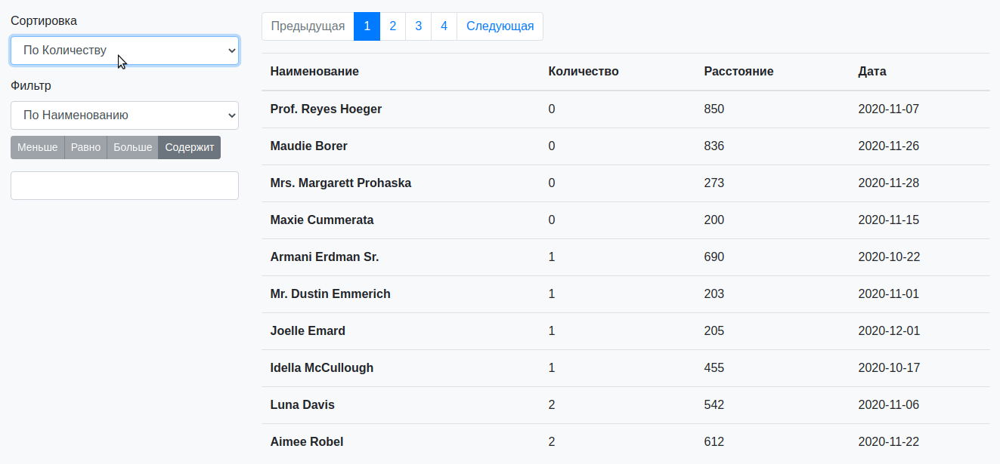

<h1>Решение тестового задания</h1>

    1. Инструкция запуска.
    <ul>
        <li>
            Если не установлен nodejs, то <a href="https://nodejs.org/en/">установить</a>;
        </li>
        <li>
            Если не установлен composer, то <a href="https://getcomposer.org/">установить</a>;
        </li>
        <li>
                   В новую папку клонировать файлы приложения:
                   <code>git clone https://github.com/Dalanes/taR8W-E-YjY.git</code>;
                </li>
                <li>
                   После чего установить все библиотеки и модули через composer:
                   
                   
                   composer update
                   composer dump-autoload
                   
</li>
                <li>
                    Зайти в файл .env.example и данные поля подредактировать под себя: 
                    
                    APP_NAME=Название_приложения
                    DB_DATABASE=Наименование_базы_данных
                    DB_USERNAME=Имя_пользователя
                    DB_PASSWORD=Пароль
                    
                    
</li>
                <li>
                    Переименовать .env.example в .env;
                </li>
                <li>
                    Выполнить следующую очередь команд, перейдя
                    в директорию проекта через консоль:
                    
                    php artisan config:cache
                    npm install
                    npm run dev
                    php artisan serve
</li>
                <li>
                    Открыть браузер и перейти на адрес, указанный в консоле.
                </li>
    </ul>

    2.Демонстрация работоспособоности:
    

